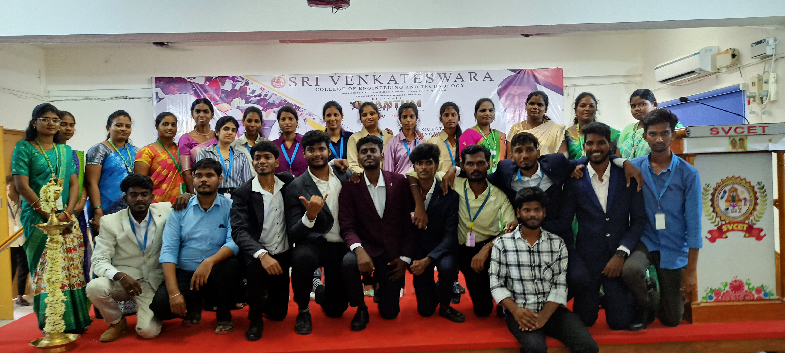

# Quantum Leap 1.0 Symposium - Organizer / Coordinator Role

**Organization:** Computer Science Department, Sri Venkateswara College of Engineering and Technology
**Role:** Symposium Organizer / Coordinator
**Duration:** February, 2025 – March, 2025 
**Location:** Tiruvallur, India

---

## Key Responsibilities and Achievements:

* **Event Management & Logistics:**
    * Organized and successfully executed 'Quantum Leap 1.0,' a college-wide symposium, managing comprehensive logistics for **100+ attendees** and multiple parallel technical events.
    * Ensured smooth registration, venue setup, scheduling, and participant flow throughout the event.

* **Technical Event Leadership - "Debugging Event":**
    * Led the "Debugging Event," a core technical competition within the symposium.
    * Designed and implemented challenging coding problem sets on **HackerRank**, effectively assessing participants' problem-solving and debugging skills.
    * Managed event execution, including participant guidance and score tracking.

* **Team Coordination & Volunteer Management:**
    * Coordinated and motivated a dedicated team of **seven student volunteers**.
    * Delegated tasks, provided clear instructions, and fostered a collaborative environment.
    * Ensured smooth event flow and positive participant engagement through effective team management.

---

## Skills Demonstrated:

* Event Management
* Project Management
* Leadership
* Teamwork & Collaboration
* Problem Solving
* Logistics Management
* Communication
* HackerRank (Platform Usage)
* Technical Content Creation

# Quantum Leap 1.0 Symposium - Organizer / Coordinator Role

---

## Event Highlights / Photo Gallery:

Here are some glimpses from the Quantum Leap 1.0 symposium:

### Principal Speech

*The main stage set up for the opening ceremony.*

### Debugging Event in Progress

*Participants engaged in the challenging Debugging Event.*

### Organizer Team

*Our dedicated team of Organizers.*

### Code Event in Progress
.
*Participants were dedicatedly engaged in coding challenges.*

### Poster Making Event

*Winners and the Organizers of the Poster Making Event.*

### FreeFire Event

*Participants gathered for competitive gameplay.*

### Connexion Event

*Participants focused on strategic thinking challenges.*

### PaperPresention Event

*Showcasing innovative research papers and presentations.*
